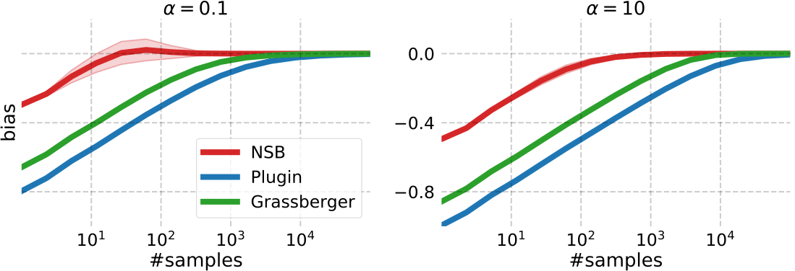

The figure shows the average bias vs the number of samples for the NSB
estimator, the "plugin" or maximum-likelihood estimator and an estimator
proposed in `Grassberger 2003 <https://arxiv.org/abs/physics/0307138>`_
(Eq. 35)

The bias was averaged over 1000 vectors of counts extracted
from a Dirichlet-multinomial distribution with alphabet size k = 10^4
for two different values of the concentration parameter alpha,
0.1 and 10.0, corresponding to average entropies of approx.
0.8 and 0.99, respectively. Logarithm base is k (the alphabet size).

